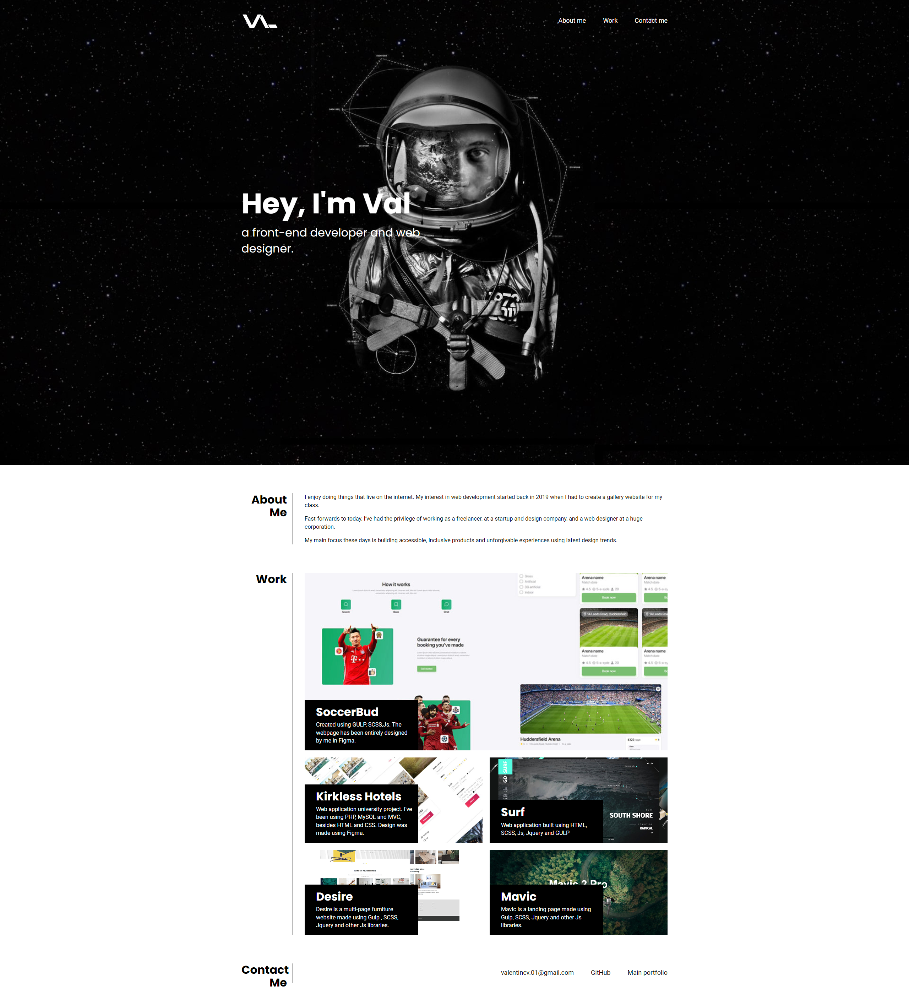

# Personal portfolio

## Description

**Task**

Building a portfolio page, where I could add my course projects. 

A portfolio to showcase my skills and talents to employers, using best front-end principles such as flexbox, grids, media queries and CSS variables. 

## Acceptance Criteria

Here are the critical requirements necessary to develop a portfolio that satisfies a typical hiring manager’s needs:

* When the page is loaded the page presents your name, a recent photo or avatar, and links to sections about you, your work, and how to contact you
* When one of the links in the navigation is clicked then the UI scrolls to the corresponding section
* When viewing the section about your work then the section contains titled images of your applications
* When presented with the your first application then that application's image should be larger in size than the others
* When images of the applications are clicked then the user is taken to that deployed application
* When the page is resized or viewed on various screens and devices then the layout is responsive and adapts to my viewport

**Why did you build this project?**

To showcase my skills and current progress using practices that I've learned at this bootcamp.

## Features

- Using Flexboxes
- Using Grids
- Active usage of position relative and absolute
- Using CSS variables
- Fully responsive
- Using BEM classes naming convention

## Webpage

- [Personal portfolio link](https://val-design-code.github.io/personal__portfolio/)
